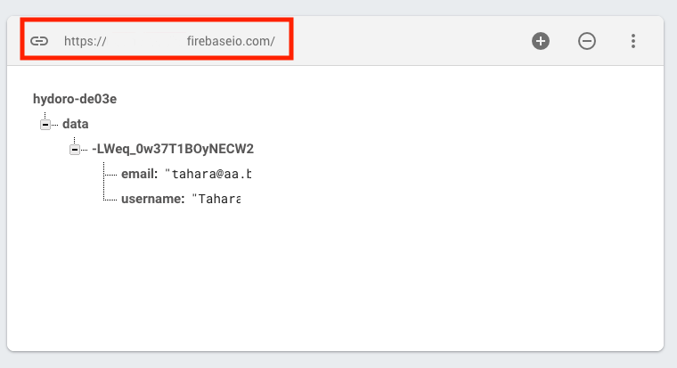

# vue-cliを使ったレスポンシブページ

目的：レスポンシブページを作成する場合に、モバイル用ページとPC用ページのHTMLのDOM構造を変更したいと考えた。

PC版で存在する要素をモバイルでは全く別の要素にしたい訳で、その例としてナビゲーションメニューをモバイル用とPC用で別個のテンプレートを使用して作成した。Vue.jsのv-ifでモバイルか否かを判定すれば簡単に切り分けができる。

モバイルの切り分けは実際のスマホを使うか、Clomeなどの検証機能からスマホを選ぶと通常の横並びのナビゲーションからハンバーガーメニューに変わる。

ブラウザの横幅を縮めたでけでは切り替わらないので注意。

横幅を取得すると切り替えは可能となると思うが、サイズの問題ではなくデバイスが何かと言うことが重要なため今回はモバイルかPCで切り分けている。


## GitHubから当該ページをダンロードして使う手順

Node.js導入済みなら、次のコマンドで私と同じ環境ができます。

``` bash
# install dependencies
npm install

# serve with hot reload at localhost:8080
npm run dev

# build for production with minification
npm run build

# build for production and view the bundle analyzer report
npm run build --report
```


## ゼロからプロジェクト作成方法

### vue-cli のインストール

```
npm install -g vue-cli
```

### プロジェクトを作成

```
vue init webpack my-project
```

プロジェクト作成は色々聞かれます。

YかNで答えます。

### サーバー起動

```
cd my-project
npm run dev
```

### ビルド

ビルドは実運用するためのファイルを書き出すものです。

distフォルダができてその中にファイルが書き出されます。

```
npm run build
```


### SASSの導入

srcに移動して下記コマンド実施

```
npm install sass-loader node-sass --save-dev
```

styleタグには以下のようにlang="scss"を付ける。

```
<style lang="scss">
/* write SASS! */
</style>
```

### GitHub Pagesへのデプロイ

完成作品をGitPagesにアップロードする方法

難しいように思えるがbuildする先をdocsフォルダに変えただけ。そのため以降buildしてもファイルはdistに入らなくなる。

GitHub Pagesはbuildしたファイルがdistではなくdocsフォルダになければならない。

`assetsPublicPath: '/' `を`./`に変更することでパスがルートパスから相対パスとなり一般のレンタルサーバーでもdocsフォルダをアップロードすれば使えるようになる。

`config/index.js`の編集

```
変更内容
index: path.resolve(__dirname, '../dist/index.html')
次のようにフォルダ名をdocsに変更
index: path.resolve(__dirname, '../docs/index.html')

変更内容
assetsRoot: path.resolve(__dirname, '../dist')
次のようにフォルダ名をdocsに変更
assetsRoot: path.resolve(__dirname, '../docs')

変更内容（build: の中にある内容）
assetsPublicPath: '/'
次のように変更
assetsPublicPath: './'
```

Index.jsを変更したら新規でdocsフォルダを作成してbuildする。

```
npm run build
```

あとは通常通りGitで「docs」フォルダを含めてpush

GitHub Pagesでは「master branch /docs folder」を選択してSaveすればOK

## template作成のポイント

### ismobilejsの使い方

モバイル用のテンプレート「gnav-sp」とPC用のテンプレート「gnav-pc」にv-ifを使って切り分けをした。

モバイルの判定は「ismobilejs」を使用した。

```bash
# npmでインストールする場合
npm install ismobilejs --save
```

「ismobilejs」インストール後読み込みはApp.vueで以下の記述で使えた。

```
created: function () {
  const isMobile = require('ismobilejs');
  this.mobile = isMobile.phone;
}
```


ハマったところは「GrobalNav_sp.vue」でのshow関数をアロー関数で書いたために「this」の指す相手がdataでなかったこと。これによりdataの値を変更できなかったこと。methodsの関数でdataを変更する場合はアロー関数は使わないことが大事。

## 親から子へデーターを渡す

App.vueのdataにあるname : 'Tahara'の値を子のテンプレートHelloAorld.vueに渡します。

親テンプレートでやること

`<hello-world :myName = name />`の中で「:myName = name」の記述をする。

:myNameとはつまり属性バインディング「v-bind:myName = name」を省略したもの。

子テンプレートでやること

`props:['myName']`の記述とデーター表示部分に「{{myName}}」を記述。これでデーターが渡される。

propsは型の指定をすることができます。型が違えばエラーをスローする。

`required:true`とすると必須項目となる。また`default:'Hoge'`とすると属性バインディングを`:myName = name` を入れなかった場合デフォルト値が表示されることになる。

### 子から親へデーターを渡す

この場合はイベントを通す。

`<button @click = "resetName">Reset Name</button>` とすることでresetName関数を定義する。

関数ではまずHogeに名前を変更して、`$emit('nameReset',this.myName)` で親にデータを渡す。

```
methods:{
    resetName(){
      this.myName = 'Hoge';
      this.$emit('nameReset',this.myName);
    }
  }
```

親では`<hello-world :myName = "name" @nameReset = "name = $event"/> `

「@nameReset = "name = $event"」でデータを受け取る。

「`$emit`」と「`$event`」がポイントとなる。


For a detailed explanation on how things work, check out the [guide](http://vuejs-templates.github.io/webpack/) and [docs for vue-loader](http://vuejs.github.io/vue-loader).

## http接続

Vue.js標準で準備された仕組みを利用（現在はAxiosを推奨）

vue-resourceを活用　https://github.com/pagekit/vue-resource

Vue CLIの場合はnpmを使う

```
npm install vue-resource
```


FirebaseのDatabaseと接続します。（リアルタイムデータベースを使用）


Main.jsに次の記述を追加することで通信できます。

```
import VueResource from 'vue-resource'

Vue.use(VueResource);
Vue.http.options.root = 'https://example.firebaseio.com/data.json'
```

input要素とdataプロパティでバインディングの仕組みを作成して以下のmethodsを定義するだけです。

this.$http.post()の第1引数はデータベースのアドレスで最後にdata.jsonをつけること。

データベースアドレスはFirebaseのDatabase項目に記述されたいるアドレスを使います。下記画像赤枠



post送信の場合、this.$http.post()の第1引数はデータベースのアドレスで第2引数に送信するデータを指定します。

データベースからデータを取得するには、this.$http.get()を使います。こちらは第1引数のみでデータベースのアドレスを入れるだけ。


また、main.jsに`Vue.http.options.root = 'https://example.firebaseio.com/data.json'`の記述をした場合はthis.$http.post()の第1引数は空にすることができます。


取得したデータは配列になっていますので下記コードのようにループ文で取り出す。

```
methods:{
    submit(){
      this.$http.post('',this.user)
        .then(response =>{
            console.log(response)
        },error=>{
            console.log(error)
        })
    },
    fetchData(){
      this.$http.get('')
        .then(response =>{
            //const data = response.json()
            return response.json()
        })
        .then(data => {
          const resultArray = []
          for (let key in data){
            resultArray.push(data[key])
          }
          this.users = resultArray
        })
    }
  }
```


## Vuexを使った状態管理

srcフォルダ内にstoreフォルダを作成してその中にstore.jsを作成します。

かくコンポーネントで共有するデータはここで集中管理できるようになります。

Store.js 記述内容

```
import Vue from 'vue'
import Vuex from 'vuex'

Vue.use(Vuex)

export const store = new Vuex.Store({
  state:{
    counter:0//ここに管理したいデータを記述
  }
})
```

あとはデータを使いたいところで次の記述をする

```
this.$store.state.counter
```

今回はCounter.vueとAPP.でcounterの値を使っている。

値の保存はメソッドを使い、読み込みはcomputedを使った。

```
methods:{
    increment(){
      this.$store.state.counter++
    },
    decrement(){
      this.$store.state.counter--
    }
  }
```


```
computed:{
    counter(){
      return this.$store.state.counter
    }
  }
```


### ゲッター

例えばdataの値をフィルタリングしたりカウントした値を表示したい場合、ストアの状態を computedで算出したいときがあります。

```js
computed:{
    counter(){
      return 'カウンターは' +　this.$store.getters.counterIs + 'です。'
    }
}
```


ここで、上記のcomuputedを色々なコンポーネントで利用したくなったら、各コンポーネントごとにcomputedをコピーするか、あるいはcomputedを共用のヘルパーに切り出して複数の場所でインポートする必要があります。しかし、どちらも理想的とはいえません。

Vuex を利用するとストア内に "ゲッター" を定義することができます。

それらをストアの算出プロパティと考えることができます。算出プロパティと同様に、ゲッターの結果はその依存関係に基づいて計算され、依存関係の一部が変更されたときにのみ再評価されます。

ゲッターは第1引数として、state を受け取ります:

```js
const store = new Vuex.Store({
   	state:{
    	counter:0
  	},
  	getters:{
    	counterIs: state => {
      	return 'カウンターは' + state.counter + 'です。'
    	}
  	}
})
```


### ミューテーション

実際に Vuex のストアの状態を変更する方法は、ミューテーションを使います。Vuex のミューテーションはイベントに応じて反応する関数のようなものです。 各ミューテーションは**タイプ**と**ハンドラ**を持ちます。ハンドラ関数は Vuex の状態（state）を第1引数として取得し、実際に状態の変更を行います:

```js
const store = new Vuex.Store({
  state: {
    count: 1
  },
  mutations:{
    decrement: state => {
      state.counter--
    }
  }
})
```

直接ミューテーションハンドラを呼び出すことはできません。この mutations オプションは、どちらかいうと "タイプが `increment` のミューテーションがトリガーされたときに、このハンドラが呼ばれる" といったイベント登録のようなものです。ミューテーションハンドラを起動するためにはミューテーションのタイプを指定して `store.commit` を呼び出す必要があります:

```js
methods:{
    decrement(){
      this.$store.commit('decrement')
    }
  }
```

